概率论基础和R语言
================

**前言：**R语言是统计语言，概率又是统计的基础，所以可以想到，R语言必然要从底层API上提供完整、方便、易用的概率计算的函数。让R语言帮我们学好概率的基础课。

一、随机事件与概率
------------------

``` r
# install.packages("prob") 
library(prob)  #load the package
```

    ## Loading required package: combinat

    ## 
    ## Attaching package: 'combinat'

    ## The following object is masked from 'package:utils':
    ## 
    ##     combn

    ## Loading required package: fAsianOptions

    ## Loading required package: timeDate

    ## Loading required package: timeSeries

    ## Loading required package: fBasics

    ## 

    ## Rmetrics Package fBasics

    ## Analysing Markets and calculating Basic Statistics

    ## Copyright (C) 2005-2014 Rmetrics Association Zurich

    ## Educational Software for Financial Engineering and Computational Science

    ## Rmetrics is free software and comes with ABSOLUTELY NO WARRANTY.

    ## https://www.rmetrics.org --- Mail to: info@rmetrics.org

    ## Loading required package: fOptions

    ## 

    ## Rmetrics Package fOptions

    ## Pricing and Evaluating Basic Options

    ## Copyright (C) 2005-2014 Rmetrics Association Zurich

    ## Educational Software for Financial Engineering and Computational Science

    ## Rmetrics is free software and comes with ABSOLUTELY NO WARRANTY.

    ## https://www.rmetrics.org --- Mail to: info@rmetrics.org

    ## 
    ## Attaching package: 'prob'

    ## The following objects are masked from 'package:base':
    ## 
    ##     intersect, setdiff, union

### 样本空间

考虑投掷硬币的随机实验，结果是H和T.我们可以使用**tosscoin函数**快速设置样本空间：

``` r
tosscoin(1) # 抛一次硬币
```

    ##   toss1
    ## 1     H
    ## 2     T

``` r
tosscoin(3) # 抛三次硬币
```

    ##   toss1 toss2 toss3
    ## 1     H     H     H
    ## 2     T     H     H
    ## 3     H     T     H
    ## 4     T     T     H
    ## 5     H     H     T
    ## 6     T     H     T
    ## 7     H     T     T
    ## 8     T     T     T

``` r
rolldie(1) # 抛一次多面体（默认为六面体）
```

    ##   X1
    ## 1  1
    ## 2  2
    ## 3  3
    ## 4  4
    ## 5  5
    ## 6  6

``` r
cards() # 抽一张扑克牌
```

    ##    rank    suit
    ## 1     2    Club
    ## 2     3    Club
    ## 3     4    Club
    ## 4     5    Club
    ## 5     6    Club
    ## 6     7    Club
    ## 7     8    Club
    ## 8     9    Club
    ## 9    10    Club
    ## 10    J    Club
    ## 11    Q    Club
    ## 12    K    Club
    ## 13    A    Club
    ## 14    2 Diamond
    ## 15    3 Diamond
    ## 16    4 Diamond
    ## 17    5 Diamond
    ## 18    6 Diamond
    ## 19    7 Diamond
    ## 20    8 Diamond
    ## 21    9 Diamond
    ## 22   10 Diamond
    ## 23    J Diamond
    ## 24    Q Diamond
    ## 25    K Diamond
    ## 26    A Diamond
    ## 27    2   Heart
    ## 28    3   Heart
    ## 29    4   Heart
    ## 30    5   Heart
    ## 31    6   Heart
    ## 32    7   Heart
    ## 33    8   Heart
    ## 34    9   Heart
    ## 35   10   Heart
    ## 36    J   Heart
    ## 37    Q   Heart
    ## 38    K   Heart
    ## 39    A   Heart
    ## 40    2   Spade
    ## 41    3   Spade
    ## 42    4   Spade
    ## 43    5   Spade
    ## 44    6   Spade
    ## 45    7   Spade
    ## 46    8   Spade
    ## 47    9   Spade
    ## 48   10   Spade
    ## 49    J   Spade
    ## 50    Q   Spade
    ## 51    K   Spade
    ## 52    A   Spade

让我们的抽样框中简单地包含三个球，分别标记为1，2和3。我们将从中**有放回**的抽取两次样品：

``` r
urnsamples(1:3, size = 2, replace = TRUE, ordered = TRUE)
```

    ##   X1 X2
    ## 1  1  1
    ## 2  2  1
    ## 3  3  1
    ## 4  1  2
    ## 5  2  2
    ## 6  3  2
    ## 7  1  3
    ## 8  2  3
    ## 9  3  3

这个实验相当于抛一个三边模具两次，我们可以用**rolldie函数**完成：

``` r
rolldie(2, nsides = 3)
```

    ##   X1 X2
    ## 1  1  1
    ## 2  2  1
    ## 3  3  1
    ## 4  1  2
    ## 5  2  2
    ## 6  3  2
    ## 7  1  3
    ## 8  2  3
    ## 9  3  3

### 随机事件

``` r
S1 <- tosscoin(2, makespace = TRUE) # 抛两次硬币的情况
S1[1:3, ] # 前三种情况
```

    ##   toss1 toss2 probs
    ## 1     H     H  0.25
    ## 2     T     H  0.25
    ## 3     H     T  0.25

``` r
S1[c(2,4),] # 第二和第四种情况
```

    ##   toss1 toss2 probs
    ## 2     T     H  0.25
    ## 4     T     T  0.25

``` r
S2 <- cards() # # 抽一张扑克牌的情况
subset(S2,suit=="Heart") # 抽取S2中的所有红心牌
```

    ##    rank  suit
    ## 27    2 Heart
    ## 28    3 Heart
    ## 29    4 Heart
    ## 30    5 Heart
    ## 31    6 Heart
    ## 32    7 Heart
    ## 33    8 Heart
    ## 34    9 Heart
    ## 35   10 Heart
    ## 36    J Heart
    ## 37    Q Heart
    ## 38    K Heart
    ## 39    A Heart

``` r
subset(S2, rank %in% 7:9) # 抽取S2中的所有7、8、9号牌
```

    ##    rank    suit
    ## 6     7    Club
    ## 7     8    Club
    ## 8     9    Club
    ## 19    7 Diamond
    ## 20    8 Diamond
    ## 21    9 Diamond
    ## 32    7   Heart
    ## 33    8   Heart
    ## 34    9   Heart
    ## 45    7   Spade
    ## 46    8   Spade
    ## 47    9   Spade

``` r
subset(rolldie(3), 
       X1 + X2 + X3 > 16) # 抛三次六面体数值之和大于16的情况
```

    ##     X1 X2 X3
    ## 180  6  6  5
    ## 210  6  5  6
    ## 215  5  6  6
    ## 216  6  6  6

``` r
A = subset(S2, suit == "Heart") # 抽取S2中的所有红心牌
B = subset(S2, rank %in% 7:9) # 抽取S2中的所有7、8、9号牌

union(A,B) # A和B的并集
```

    ##    rank    suit
    ## 6     7    Club
    ## 7     8    Club
    ## 8     9    Club
    ## 19    7 Diamond
    ## 20    8 Diamond
    ## 21    9 Diamond
    ## 27    2   Heart
    ## 28    3   Heart
    ## 29    4   Heart
    ## 30    5   Heart
    ## 31    6   Heart
    ## 32    7   Heart
    ## 33    8   Heart
    ## 34    9   Heart
    ## 35   10   Heart
    ## 36    J   Heart
    ## 37    Q   Heart
    ## 38    K   Heart
    ## 39    A   Heart
    ## 45    7   Spade
    ## 46    8   Spade
    ## 47    9   Spade

``` r
intersect(A,B) # A和B的交集
```

    ##    rank  suit
    ## 32    7 Heart
    ## 33    8 Heart
    ## 34    9 Heart

``` r
setdiff(B,A) # B中排除A
```

    ##    rank    suit
    ## 6     7    Club
    ## 7     8    Club
    ## 8     9    Club
    ## 19    7 Diamond
    ## 20    8 Diamond
    ## 21    9 Diamond
    ## 45    7   Spade
    ## 46    8   Spade
    ## 47    9   Spade

``` r
setdiff(S2,A) # S2中排除A
```

    ##    rank    suit
    ## 1     2    Club
    ## 2     3    Club
    ## 3     4    Club
    ## 4     5    Club
    ## 5     6    Club
    ## 6     7    Club
    ## 7     8    Club
    ## 8     9    Club
    ## 9    10    Club
    ## 10    J    Club
    ## 11    Q    Club
    ## 12    K    Club
    ## 13    A    Club
    ## 14    2 Diamond
    ## 15    3 Diamond
    ## 16    4 Diamond
    ## 17    5 Diamond
    ## 18    6 Diamond
    ## 19    7 Diamond
    ## 20    8 Diamond
    ## 21    9 Diamond
    ## 22   10 Diamond
    ## 23    J Diamond
    ## 24    Q Diamond
    ## 25    K Diamond
    ## 26    A Diamond
    ## 40    2   Spade
    ## 41    3   Spade
    ## 42    4   Spade
    ## 43    5   Spade
    ## 44    6   Spade
    ## 45    7   Spade
    ## 46    8   Spade
    ## 47    9   Spade
    ## 48   10   Spade
    ## 49    J   Spade
    ## 50    Q   Spade
    ## 51    K   Spade
    ## 52    A   Spade

### 计算概率

**生日问题**

假设在一个房间里有n个人在一起。每个人轮流公布他/她的生日的日期，求至少有两个人生日相同的概率是多少？

**pbirthday**计算广义生日悖论问题中生日重合的概率，这里用**sapply函数**将pbirthday应用到人数向量中。

``` r
g <- sapply(1:50, pbirthday)
plot (1:50 , g,
      xlab = "Number of people in room ",
      ylab = "Prob (at least one match )",
      main = "The Birthday Problem")
abline (h = 0.5)
abline (v = 23, lty = 2) # 虚线
```

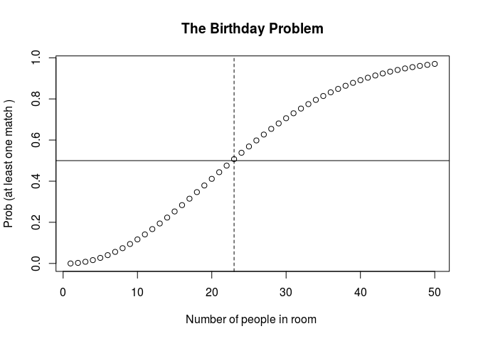

或者可以自己写计算概率的函数：

``` r
prob.birth<-function(n)
  {if( n< 365) 
    return(1-choose(365,n)*factorial(n)/365^n)
  else
    return(1)
  }

g2 <- sapply(1:50, prob.birth)
plot (1:50 , g2,
      xlab = "Number of people in room ",
      ylab = "Prob (at least one match )",
      main = "The Birthday Problem")
abline (h = 0.5)
abline (v = 23, lty = 2) # 虚线
```


如果你要计算至少有一个人和你生日相同的概率：

``` r
q.birth<-function(n){return(1-(364/365)^n)}
x <- 0:50
z <- NULL
for(i in 1:length(x))z[i]<-q.birth(x[i])
plot(x,z,
     xlab = "Number of people in room ",
     ylab = "Prob (at least one match with you)",
     main = "The Birthday Problem")
points(x,z)
```

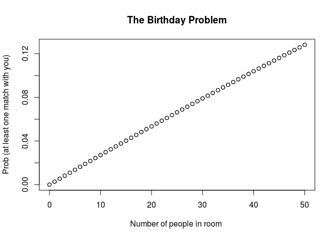

**Buffon投针试验**

18世纪，布丰提出以下问题：设我们有一个以平行且等距木纹铺成的地板，现在随意抛一支长度比木纹之间距离小的针，求针和其中一条木纹相交的概率。并以此概率，布丰提出的一种计算圆周率的方法——随机投针法。这就是蒲丰投针问题（又译“布丰投针问题”）

``` r
# 绘制空白图形
plot(c(0,2),c(0,2),type='n',main='布丰投针实验',xlab='X',ylab='Y')
# 增加平行线
abline(h=0.5)
abline(h=1.5,col='red')
finished <- FALSE
# trial为实验次数，cross为交叉次数
trial <- 0
cross <- 0
for(i in 1:50){
    # Dist为针的中心距离红线的垂直距离
    # Theta为针的角度
    Dist <- runif(1,min=0,max=1/2)
    Theta <- runif(1,0,pi)
    # central.x为针中心点的横坐标
    # central.y为针中心点的纵坐标
    central.x <- runif(1,0.5,1.5)
    central.y <- Dist +1
    # 计算针两端的坐标
    y1 <- sin(Theta)/4 + central.y
    x1 <- cos(Theta)/4 + central.x
    y2 <- sin(Theta+pi)/4 + central.y
    x2 <- cos(Theta+pi)/4 + central.x
    trial <- trial +1
    # 计数交叉次数
    cross <- cross + ifelse(0.25*sin(Theta)>=Dist,1,0)
    # 绘制针的线型和中心点
    lines(c(x1,x2),c(y1,y2),lty=2)
    points(central.x,central.y,pch=16,col='grey')
    cat('trial=',trial,'cross=',cross,'PI=',trial/cross,'\n')
}
```


    ## trial= 1 cross= 1 PI= 1 
    ## trial= 2 cross= 2 PI= 1 
    ## trial= 3 cross= 2 PI= 1.5 
    ## trial= 4 cross= 2 PI= 2 
    ## trial= 5 cross= 3 PI= 1.666667 
    ## trial= 6 cross= 3 PI= 2 
    ## trial= 7 cross= 3 PI= 2.333333 
    ## trial= 8 cross= 3 PI= 2.666667 
    ## trial= 9 cross= 3 PI= 3 
    ## trial= 10 cross= 4 PI= 2.5 
    ## trial= 11 cross= 4 PI= 2.75 
    ## trial= 12 cross= 5 PI= 2.4 
    ## trial= 13 cross= 5 PI= 2.6 
    ## trial= 14 cross= 5 PI= 2.8 
    ## trial= 15 cross= 5 PI= 3 
    ## trial= 16 cross= 6 PI= 2.666667 
    ## trial= 17 cross= 6 PI= 2.833333 
    ## trial= 18 cross= 7 PI= 2.571429 
    ## trial= 19 cross= 7 PI= 2.714286 
    ## trial= 20 cross= 7 PI= 2.857143 
    ## trial= 21 cross= 7 PI= 3 
    ## trial= 22 cross= 7 PI= 3.142857 
    ## trial= 23 cross= 8 PI= 2.875 
    ## trial= 24 cross= 9 PI= 2.666667 
    ## trial= 25 cross= 9 PI= 2.777778 
    ## trial= 26 cross= 9 PI= 2.888889 
    ## trial= 27 cross= 9 PI= 3 
    ## trial= 28 cross= 10 PI= 2.8 
    ## trial= 29 cross= 10 PI= 2.9 
    ## trial= 30 cross= 11 PI= 2.727273 
    ## trial= 31 cross= 11 PI= 2.818182 
    ## trial= 32 cross= 11 PI= 2.909091 
    ## trial= 33 cross= 11 PI= 3 
    ## trial= 34 cross= 11 PI= 3.090909 
    ## trial= 35 cross= 11 PI= 3.181818 
    ## trial= 36 cross= 12 PI= 3 
    ## trial= 37 cross= 13 PI= 2.846154 
    ## trial= 38 cross= 14 PI= 2.714286 
    ## trial= 39 cross= 15 PI= 2.6 
    ## trial= 40 cross= 16 PI= 2.5 
    ## trial= 41 cross= 16 PI= 2.5625 
    ## trial= 42 cross= 16 PI= 2.625 
    ## trial= 43 cross= 16 PI= 2.6875 
    ## trial= 44 cross= 17 PI= 2.588235 
    ## trial= 45 cross= 17 PI= 2.647059 
    ## trial= 46 cross= 17 PI= 2.705882 
    ## trial= 47 cross= 17 PI= 2.764706 
    ## trial= 48 cross= 17 PI= 2.823529 
    ## trial= 49 cross= 18 PI= 2.722222 
    ## trial= 50 cross= 18 PI= 2.777778

### 条件概率

``` r
S3 <- rolldie(2, makespace = TRUE) # assumes ELM
head(S3)
```

    ##   X1 X2      probs
    ## 1  1  1 0.02777778
    ## 2  2  1 0.02777778
    ## 3  3  1 0.02777778
    ## 4  4  1 0.02777778
    ## 5  5  1 0.02777778
    ## 6  6  1 0.02777778

``` r
A <- subset(S3, X1 == X2)
B <- subset(S3, X1 + X2 >= 8)
Prob(A,given=B) # B的条件下求A的概率
```

    ## [1] 0.2

``` r
Prob(S3,X1==X2, given=(X1+X2>=8)) # X1+X2>=8的条件下求A的概率
```

    ## [1] 0.2

二、随机变量及其分布
--------------------

随机变量（random variable）表示随机现象各种结果的实值函数。随机变量是定义在样本空间S上，取值在实数载上的函数，由于它的自变量是随机试验的结果，而随机实验结果的出现具有随机性，因此，随机变量的取值具有一定的随机性。

如：生成一个在(0,1,2,3,4,5)的随机变量

``` r
S <- 1:5
sample(S,1)
```

    ## [1] 5

``` r
sample(S,1)
```

    ## [1] 3

``` r
sample(S,1)
```

    ## [1] 3

R语言中提供了四类有关统计分布的函数**（密度函数，累计分布函数，分位数函数，随机数函数）**，分别在代表该分布的R函数前加上相应前缀**d，p，q，r**获得。如正态分布的函数是norm：

1.**dnorm(0)**就可以获得正态分布的密度函数在0处的值(0.3989)(默认为标准正态分布)。

2.**pnorm(0)**是0.5就是正态分布的累计密度函数在0处的值。

3.**qnorm(0.5)**则得到的是0，即标准正态分布在0.5处的分位数是0（在来个比较常用的：qnorm(0.975)就是那个估计中经常用到的1.96了）。

4.**rnorm(n)**则是按正态分布随机产生n个数据。

### 离散型随机变量

如果随机变量X的全部可能的取值只有有限多个或可列无穷多个，则称X为离散型随机变量。

如：生成样本空间为(1,2,3)的随机变量X，X的取值是有限的

``` r
S <- 1:3
X <- sample(S,1);X
```

    ## [1] 3

下面分别列举常见的离散型分布。

**二项分布**

在概率论和统计学中，二项分布（英语：Binomial distribution）是n个独立的是/非试验中成功的次数的离散概率分布，其中每次试验的成功概率为p。这样的单次成功/失败试验又称为伯努利试验。实际上，当n = 1时，二项分布就是伯努利分布。二项分布是显著性差异的二项试验的基础。

``` r
dbinom(x=2,size=20,prob=0.5)
```

    ## [1] 0.0001811981

``` r
pbinom(q=2,size=20,prob=0.5)
```

    ## [1] 0.0002012253

``` r
qbinom(p=0.4,size=20,prob=0.5)
```

    ## [1] 9

``` r
rbinom(n=5,size=20,prob=0.5)
```

    ## [1] 10 12 11  9 13

``` r
plot(dbinom(0:20,size=20,prob=0.5),type="h")
```


``` r
plot(dbinom(0:20,size=20,prob=0.8),type="h")
```


**超几何分布**

超几何分布描述了由有限个物件中抽出n个物件，成功抽出指定种类的物件的个数（不归还）。

``` r
dhyper(x=2, m=10, n=30, k=6)
```

    ## [1] 0.3212879

``` r
phyper(q=2, m=10, n=30, k=6)
```

    ## [1] 0.8472481

``` r
qhyper(0.3, m=10, n=30, k=6)
```

    ## [1] 1

``` r
rhyper(nn=10, m=10, n=30, k=6)
```

    ##  [1] 2 1 1 2 3 1 1 3 1 3

**几何分布**

几何分布描述了n次伯努利试验中，试验k次才得到第一次成功的机率。

``` r
dgeom(4,prob=0.8)
```

    ## [1] 0.00128

``` r
pgeom(4, prob = 0.8)
```

    ## [1] 0.99968

``` r
qgeom(0.4,prob=0.8)
```

    ## [1] 0

``` r
rgeom(10,prob=0.8)
```

    ##  [1] 0 0 0 0 0 0 0 0 0 0

``` r
plot(dgeom(0:20,prob=0.5),type="h")
```


``` r
plot(dgeom(0:20,prob=0.8),type="h")
```

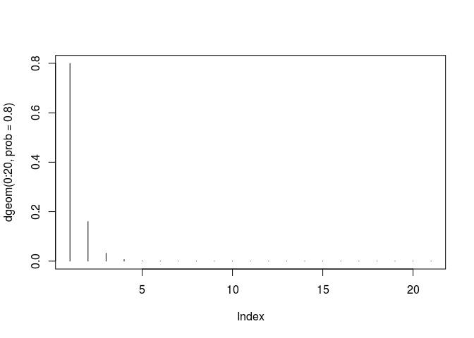

**负二项分布**

“负二项分布”与“二项分布”的区别在于：“二项分布”是固定试验总次数N的独立试验中，成功次数k的分布；而“负二项分布”是所有到成功r次时即终止的独立试验中，失败次数k的分布。

``` r
dnbinom(x=5,size=3,prob=0.4)   
```

    ## [1] 0.1045094

``` r
pnbinom(5,size=3,prob=0.4)
```

    ## [1] 0.6846054

``` r
qnbinom(0.5,size=3,prob=0.4)
```

    ## [1] 4

``` r
rnbinom(n=10,size=3,prob=0.4)
```

    ##  [1] 5 0 8 4 0 0 0 0 5 0

``` r
plot(dnbinom(0:20,size=5,p=0.5),type="h")
```


**泊松分布**

泊松分布适合于描述单位时间内随机事件发生的次数的概率分布。如某一服务设施在一定时间内受到的服务请求的次数，电话交换机接到呼叫的次数、汽车站台的候客人数、机器出现的故障数、自然灾害发生的次数、DNA序列的变异数、放射性原子核的衰变数、激光的光子数分布等等。参数λ是单位时间（或单位面积）内随机事件的平均发生率。

``` r
dpois(x=0,lambda=2.4)
```

    ## [1] 0.09071795

``` r
ppois(q=10,lambda=2.4)
```

    ## [1] 0.999957

``` r
qpois(p=0.9,lambda=2.4)
```

    ## [1] 4

``` r
rpois(n=10,lambda=2.4)
```

    ##  [1] 0 1 3 3 3 3 3 2 6 7

``` r
plot(dpois(0:20,lambda=1),type="h")
```

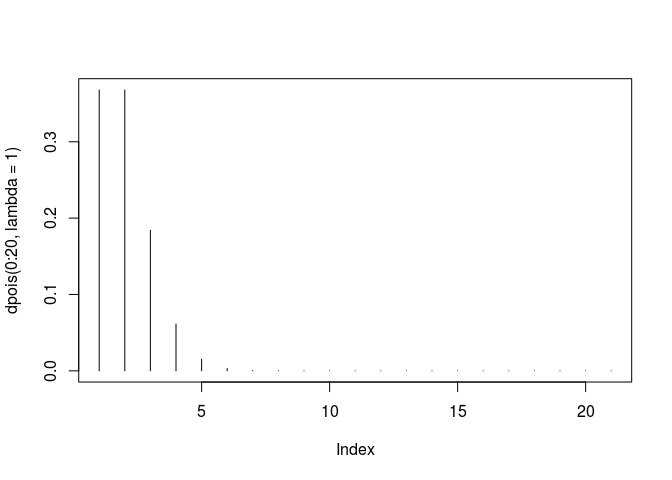

``` r
x <- 0:20
plot(x, ppois(x, 1), type="s", lty=1,ylab="F(x)", main="Poisson approx of binomial")
lines(x, pbinom(x, 100, 0.01),type="s",col=2,lty=2)
legend("bottomright",legend=c("Poisson","Binomial"),lty=1:2,col=1:2)
```

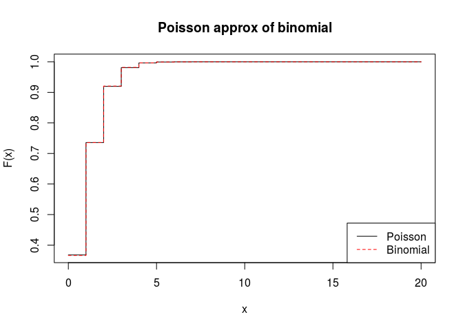

**二项分布的泊松近似和正态近似**

二项分布有两种近似处理方法：

1.当试验的次数n趋于无穷大，而乘积np固定时，二项分布收敛于泊松分布。因此参数为λ = np的泊松分布可以作为二项分布B(n, p)的近似。

2.如果n足够大，那么分布的偏度就比较小。在这种情况下，如果使用适当的连续性校正，那么B(n, p)的一个很好的近似是正态分布.

``` r
#P(X<=k)=pbinom(k,n,p)
#Poisson approximation: P(X<=k) app ppois(k,np)
#Normal approximation: P(X<=k) app pnorm(k,np,npq)

apprx <- function(n, p, R = 1000, k = 6) {
  trueval <- pbinom(k, n, p) # true binomial probability
  prob.zcc <- prob.zncc <- prob.pois <- NULL  
  q <- 1-p
  for (i in 1:R) {
    x <- rnorm(n, n * p, sqrt(n * p * q))
    z.cc <- ((k + .5) - mean(x))/sd(x) # with cont. correction
    prob.zcc[i] <- pnorm(z.cc)
    z.ncc <- (k - mean(x))/sd(x) # no cont. correction
    prob.zncc[i] <- pnorm(z.ncc)    
    y <- rpois(n, n * p)
    prob.pois[i] <- length(y[y <= k])/n
  }
  list(prob.zcc = prob.zcc, prob.zncc = prob.zncc, 
       prob.pois = prob.pois, trueval = trueval)
}

R <- 1000
set.seed(10)
out <- apprx(n = 200, p = .03, k = 6, R = 1000)
# windows(6,5)
plot(1:R, out$prob.pois, type = "l", 
     col = "green", xlab = "Runs", 
     main = expression(paste("Simulated Probabilities: ", 
                             n==200, ", ", p==0.03, sep="")),
     ylab = "Probability", ylim = c(.3, .7))
abline(h = out$trueval, col="red", lty=2)
lines(1:R, out$prob.zcc, lty = 1, col = "purple")
lines(1:R, out$prob.zncc, lty = 1, col = "orange")
legend("bottomleft", 
       c("Poisson", "Normal (with cc)", "Normal (w/o cc)"),
       lty = c(1), col = c("green", "purple", "orange"))
```


``` r
set.seed(10)
out <- apprx(n = 200, p = .03, k = 6, R = 1000)
# windows(6,5)
boxplot(out$prob.pois, boxwex = 0.25, at = 1:1 - .25,
        col = "green",
        main = expression(paste("Approximating Binomial Probability: ", 
                                n==200, ", ", p==0.03, sep="")),
        ylab = "Probablity", 
        ylim = c(out$trueval - 0.2, out$trueval + 0.25))
boxplot(out$prob.zcc, boxwex = 0.25, at = 1:1 + 0, add = T,
         col = "purple")
boxplot(out$prob.zncc, boxwex = 0.25, at = 1:1 + 0.25, add = T,
         col = "orange" )
abline(h = out$trueval, col = "red", lty=2)
legend("topleft", c("Poisson", "Normal (with cc)", "Normal (w/o cc)"), 
           fill = c("green", "purple", "orange"))
```


### 连续型随机变量

随机变量X，取值可以在某个区间内取任一实数，即变量的取值可以是连续的，这随机变量就称为连续型随机变量。

如：生成样本在空间(0,1)的连续随机函数，取10个值。

``` r
runif(10,0,1)
```

    ##  [1] 0.296068821 0.771418765 0.160873560 0.007265907 0.620399207
    ##  [6] 0.985506029 0.498403399 0.510171622 0.414011199 0.731269743

下面列举常见的连续型分布：

**正态分布**

正态分布(Normal distribution)又名高斯分布(Gaussian distribution)，是一个在数学、物理及工程等领域都非常重要的概率分布，在统计学的许多方面有着重大的影响力。

若随机变量X服从一个数学期望为μ、方差为σ<sup>2的正态分布，记为N(μ，σ</sup>2)。其概率密度函数为正态分布的期望值μ决定了其位置，其标准差σ决定了分布的幅度。因其曲线呈钟形，因此人们又经常称之为钟形曲线。我们通常所说的标准正态分布是μ = 0,σ = 1的正态分布。

``` r
dnorm(0,mean=0,sd=1)
```

    ## [1] 0.3989423

``` r
pnorm(0)
```

    ## [1] 0.5

``` r
qnorm(2.5/100,lower.tail=F)
```

    ## [1] 1.959964

``` r
rnorm(10,mean=1,sd=1.5)
```

    ##  [1]  1.5888671  0.6617092  2.2173455  1.1084923 -0.3535931  2.7531498
    ##  [7]  1.9690012  1.5512389  0.5477978  0.2339650

``` r
# some plots

x <- seq(-4, 4, length = 401)
plot(x, dnorm(x), type = 'l') # N(0, 1)
# N(1, 1.5^2):
lines(x, dnorm(x, mean = 1, sd = 1.5), lty = 'dashed')
```


``` r
u <- seq(0, 1, length=401)
plot(u, qnorm(u), 'l')
# lower.tail = FALSE gives q(1-u)
lines(u, qnorm(u, lower.tail = FALSE), lty = 'dashed')
```

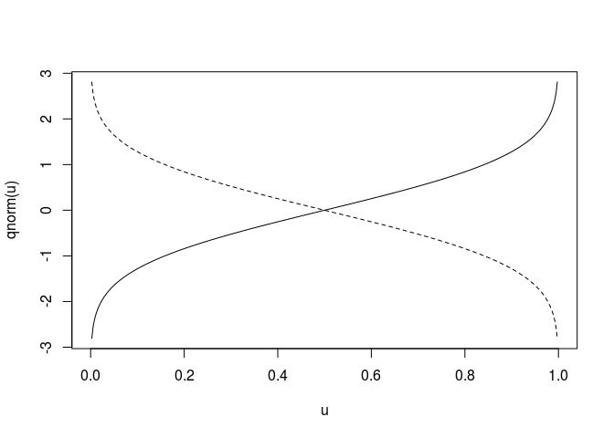

比较不同参数下的正态分布的分布函数和密度函数形状：

``` r
#cumulative distribution function
curve(pnorm(x), xlim=c(-5,5), col='red', lwd=3)
title(main='Cumulative gaussian distribution function')
curve(pnorm(x,1,1), xlim=c(-5,5), col='green', lwd=3,add=T)
curve(pnorm(x,1,2),  xlim=c(-5,5), col='black', lwd=3,add=T)
legend(-par('usr')[2], par('usr')[4], xjust=-0.5,
       c('standard norm', 'normal(1,1)','normal(1,2)'),
       lwd=2, col=c('red','green','black'))
```


``` r
#density
curve(dnorm(x), xlim=c(-5,5), col='red', lwd=3)
curve(dnorm(x,1,1), add=T, col='green', lty=2, lwd=3)
curve(dnorm(x,1,2), add=T, col='black', lty=3, lwd=3)

legend(par('usr')[2], par('usr')[4], xjust=1,
       c('standard normal', 'normal(1,1)','normal(1,2)'),
       lwd=2, lty=c(1,2,3),
       col=c('red','green','black'))
```

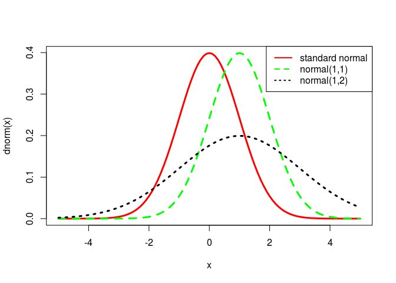

混合正态（高斯）分布：

混合高斯模型是用高斯概率密度函数（正态分布曲线）精确地量化事物，将一个事物分解为若干的基于高斯概率密度函数（正态分布曲线）形成的模型。通俗点讲，无论观测数据集如何分布以及呈现何种规律，都可以通过多个单一高斯模型的混合进行拟合。

``` r
m <- c(-2,0,2)    # Means
p <- c(.3,.4,.3)  # Probabilities
s <- c(1, 1, 1)   # Standard deviations
 
curve(p[2]*dnorm(x, mean=m[2], sd=s[2]),
      col = "green", lwd = 3, 
      xlim = c(-5,5),ylim=c(0,0.23),
      main = "The three gaussian distributions in our mixture",
      xlab = "", ylab = "")
curve(p[1]*dnorm(x, mean=m[1], sd=s[1]),
      col="red", lwd=3, add=TRUE)
curve(p[3]*dnorm(x, mean=m[3], sd=s[3]),
      col="blue", lwd=3, add=TRUE)
curve(p[1]*dnorm(x, mean=m[1], sd=s[1])+
      p[2]*dnorm(x, mean=m[2], sd=s[2])+
      p[3]*dnorm(x, mean=m[3], sd=s[3]),
      col="black", lwd=3, add=TRUE)
```


**Shapiro-Wilk正态分布检验:** 用来检验是否数据符合正态分布，类似于线性回归的方法一样，是检验其于回归曲线的残差。该方法推荐在样本量很小的时候使用，样本在3到5000之间。该检验原假设为H0:数据集符合正态分布，统计量W 最大值是1，越接近1，表示样本与正态分布匹配，如果p-value小于显著性水平α(0.05)，则拒绝H0。

``` r
set.seed(1)
S<-rnorm(1000)
shapiro.test(S)
```

    ## 
    ##  Shapiro-Wilk normality test
    ## 
    ## data:  S
    ## W = 0.99876, p-value = 0.7256

``` r
cat('结论: W接近1，p-value>0.05，不能拒绝原假设，所以数据集S符合正态分布！')
```

    ## 结论: W接近1，p-value>0.05，不能拒绝原假设，所以数据集S符合正态分布！

**指数分布**

指数分布(Exponential distribution)用来表示独立随机事件发生的时间间隔，比如旅客进机场的时间间隔、中文维基百科新条目出现的时间间隔等等。

许多电子产品的寿命分布一般服从指数分布。有的系统的寿命分布也可用指数分布来近似。它在可靠性研究中是最常用的一种分布形式。指数分布是伽玛分布和weibull分布的特殊情况，产品的失效是偶然失效时，其寿命服从指数分布。

指数分布可以看作当weibull分布中的形状系数等于1的特殊分布，指数分布的失效率是与时间t无关的常数，所以分布函数简单。

``` r
dexp(5, rate = 1, log = FALSE)
```

    ## [1] 0.006737947

``` r
pexp(5, rate = 1, lower.tail = TRUE, log.p = FALSE)
```

    ## [1] 0.9932621

``` r
qexp(5, rate = 1, lower.tail = TRUE, log.p = FALSE)
```

    ## Warning in qexp(5, rate = 1, lower.tail = TRUE, log.p = FALSE): NaNs
    ## produced

    ## [1] NaN

``` r
rexp(5, rate = 1)
```

    ## [1] 0.60090057 0.75018932 0.16690328 2.20522547 0.05532531

比较不同参数下的指数分布的分布函数和密度函数形状：

``` r
#cumulative distribution function
curve(pexp(x,rate=0.5), xlim=c(0,10), col=1, lwd=3,
      main='Exponential Probability Distribution Function')
curve(pexp(x,rate=1), xlim=c(0,10), col=2, lwd=2, lty=2,
      add=T)
curve(pexp(x,rate=5), xlim=c(0,10), col=3, lwd=2, lty=3,
      add=T)
curve(pexp(x,rate=10), xlim=c(0,10), col=4, lwd=2, lty=4,
      add=T)
legend(par('usr')[2], par('usr')[4], xjust=1,
       c('rate=0.5','rate=1', 'rate=2','rate=10'),
       lwd=2, lty=c(1,2,3,4),
       col=1:4)
```

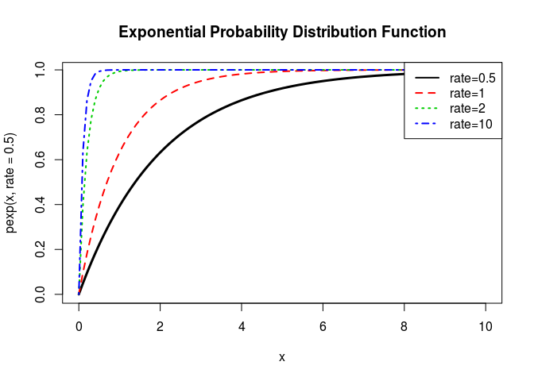

``` r
#density
curve(dexp(x,rate=0.5), xlim=c(0,10), col=1, lwd=3,
      main='Exponential Probability Distribution Function')
curve(dexp(x,rate=1), xlim=c(0,10), col=2, lwd=2, lty=2,
      add=T)
curve(dexp(x,rate=5), xlim=c(0,10), col=3, lwd=2, lty=3,
      add=T)
curve(dexp(x,rate=10), xlim=c(0,10), col=4, lwd=2, lty=4,
      add=T)
legend(par('usr')[2], par('usr')[4], xjust=1,
       c('rate=0.5','rate=1', 'rate=2','rate=10'),
       lwd=2, lty=1:4,
       col=1:4)
```

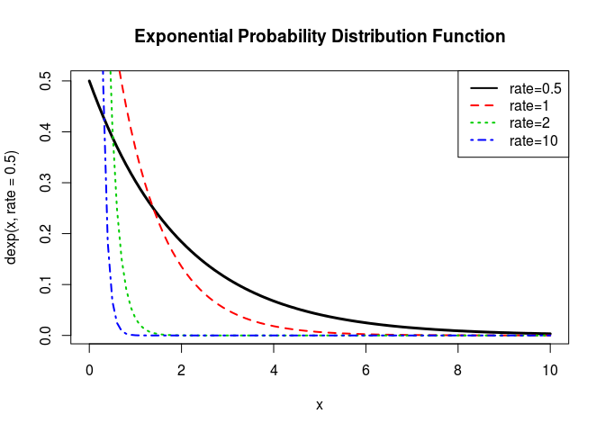

**均匀分布**

均匀分布(Uniform distribution)是均匀的，不偏差的一种简单的概率分布，分为：离散型均匀分布与连续型均匀分布。

``` r
set.seed(1)
x<-seq(0,10,length.out=1000)
y<-dunif(x,0,1)

plot(x,y,col="red",xlim=c(0,10),ylim=c(0,1.2),type='l',
     xaxs="i", yaxs="i",ylab='density',xlab='',
     main="The Uniform Density Distribution")
lines(x,dnorm(x,0,0.5),col="green")
lines(x,dnorm(x,0,2),col="blue")
lines(x,dnorm(x,-2,1),col="orange")
lines(x,dnorm(x,4,2),col="purple")

legend("topright",legend=paste("m=",c(0,0,0,-2,4)," sd=", c(1,0.5,2,1,2)), lwd=1, col=c("red", "green","blue","orange","purple"))
```


``` r
plot(x,y,col="red",xlim=c(0,10),ylim=c(0,1.2),type='l',
     xaxs="i", yaxs="i",ylab='density',xlab='',
     main="The Uniform Cumulative Distribution Function")

lines(x,punif(x,0,0.5),col="green")
lines(x,punif(x,0,2),col="blue")
lines(x,punif(x,-2,1),col="orange")

legend("bottomright",legend=paste("m=",c(0,0,0,-2)," sd=", c(1,0.5,2,1)), lwd=1, col=c("red", "green","blue","orange","purple"))
```

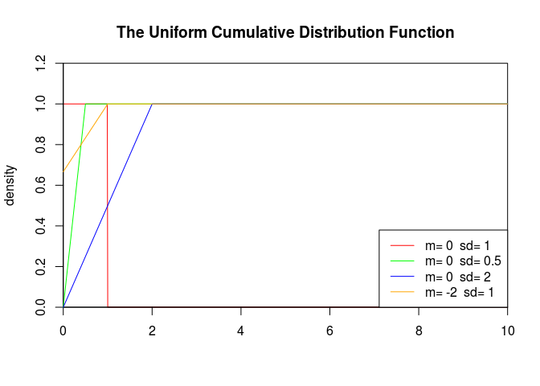

**伽马分布**

伽玛分布(Gamma)是著名的皮尔逊概率分布函数簇中的重要一员，称为皮尔逊Ⅲ型分布。它的曲线有一个峰，但左右不对称。伽玛分布中的参数α，称为形状参数，β称为尺度参数。

``` r
set.seed(1)
x<-seq(0,10,length.out=100)
y<-dgamma(x,1,2)

plot(x,y,col="red",xlim=c(0,10),ylim=c(0,2),type='l',
     xaxs="i", yaxs="i",ylab='density',xlab='',
     main="The Gamma Density Distribution")

lines(x,dgamma(x,2,2),col="green")
lines(x,dgamma(x,3,2),col="blue")
lines(x,dgamma(x,5,1),col="orange")
lines(x,dgamma(x,9,1),col="black")

legend("topright",legend=paste("shape=",c(1,2,3,5,9)," rate=", c(2,2,2,1,1)), lwd=1, col=c("red", "green","blue","orange","black"))
```

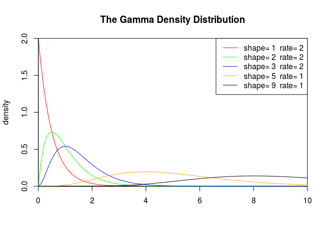

``` r
plot(x,y,col="red",xlim=c(0,10),ylim=c(0,1),type='l',
     xaxs="i", yaxs="i",ylab='density',xlab='',
     main="The Gamma Cumulative Distribution Function")

lines(x,pgamma(x,2,2),col="green")
lines(x,pgamma(x,3,2),col="blue")
lines(x,pgamma(x,5,1),col="orange")
lines(x,pgamma(x,9,1),col="black")

legend("bottomright",legend=paste("shape=",c(1,2,3,5,9)," rate=", c(2,2,2,1,1)), lwd=1, col=c("red", "green","blue","orange","black"))
```

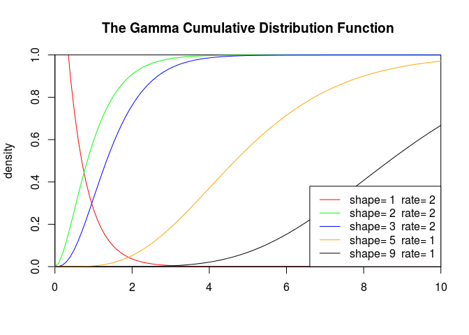

**贝塔分布**

贝塔分布(Beta Distribution)是指一组定义在(0,1)区间的连续概率分布，Beta分布有α和β两个参数α,β&gt;0，其中α为成功次数加1，β为失败次数加1。

Beta分布的一个重要应该是作为伯努利分布和二项式分布的共轭先验分布出现，在机器学习和数理统计学中有重要应用。贝塔分布中的参数可以理解为伪计数，伯努利分布的似然函数可以表示为，表示一次事件发生的概率，它为贝塔有相同的形式，因此可以用贝塔分布作为其先验分布。

``` r
set.seed(1)
x<-seq(-5,5,length.out=10000)
y<-dbeta(x,0.5,0.5)
  
plot(x,y,col="red",xlim=c(0,1),ylim=c(0,6),type='l',
     xaxs="i", yaxs="i",ylab='density',xlab='',
     main="The Beta Density Distribution")

lines(x,dbeta(x,5,1),col="green")
lines(x,dbeta(x,1,3),col="blue")
lines(x,dbeta(x,2,2),col="orange")
lines(x,dbeta(x,2,5),col="black")

legend("top",legend=paste("a=",c(.5,5,1,2,2)," b=", c(.5,1,3,2,5)), lwd=1,col=c("red", "green","blue","orange","black"))
```

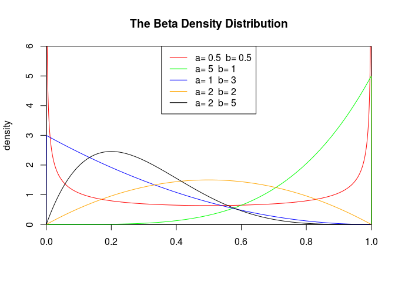

``` r
plot(x,y,col="red",xlim=c(0,1),ylim=c(0,1),type='l',
     xaxs="i", yaxs="i",ylab='density',xlab='',
     main="The Beta Cumulative Distribution Function")

lines(x,pbeta(x,5,1),col="green")
lines(x,pbeta(x,1,3),col="blue")
lines(x,pbeta(x,2,2),col="orange")
lines(x,pbeta(x,2,5),col="black")

legend("topleft",legend=paste("a=",c(.5,5,1,2,2)," b=", c(.5,1,3,2,5)), lwd=1,col=c("red", "green","blue","orange","black"))
```

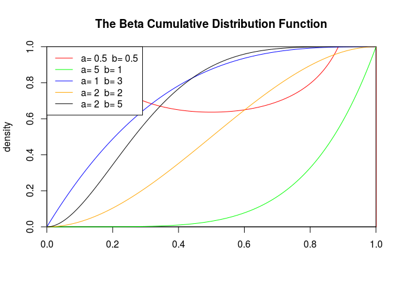

**χ²(卡方)分布**

若n个相互独立的随机变量ξ₁、ξ₂、……、ξn ，均服从标准正态分布（也称独立同分布于标准正态分布），则这n个服从标准正态分布的随机变量的平方和构成一新的随机变量，其分布规律称为χ²分布（chi-square distribution）。其中参数n称为自由度，自由度不同就是另一个χ²分布，正如正态分布中均值或方差不同就是另一个正态分布一样。

``` r
set.seed(1)
x<-seq(0,10,length.out=1000)
y<-dchisq(x,1)

plot(x,y,col="red",xlim=c(0,5),ylim=c(0,2),type='l',
     xaxs="i", yaxs="i",ylab='density',xlab='',
     main="The Chisq Density Distribution")

lines(x,dchisq(x,2),col="green")
lines(x,dchisq(x,3),col="blue")
lines(x,dchisq(x,10),col="orange")

legend("topright",legend=paste("df=",c(1,2,3,10)), lwd=1, col=c("red", "green","blue","orange"))
```


``` r
plot(x,y,col="red",xlim=c(0,10),ylim=c(0,1),type='l',
     xaxs="i", yaxs="i",ylab='density',xlab='',
     main="The Chisq Cumulative Distribution Function")

lines(x,pchisq(x,2),col="green")
lines(x,pchisq(x,3),col="blue")
lines(x,pchisq(x,10),col="orange")

legend("topleft",legend=paste("df=",c(1,2,3,10)), lwd=1, col=c("red", "green","blue","orange"))
```

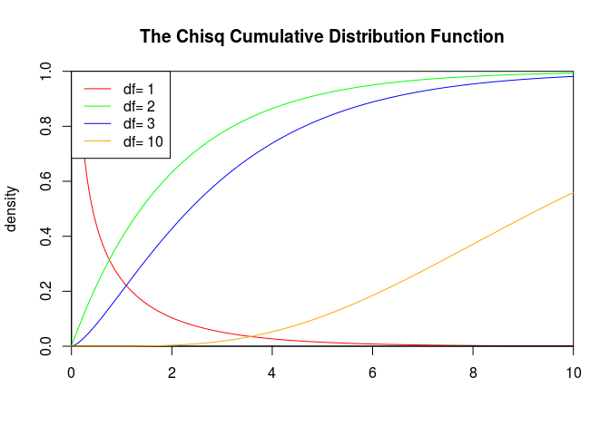

**F分布**

F-分布（F-distribution）是一种连续概率分布，被广泛应用于似然比率检验，特别是ANOVA中。F分布定义为：设X、Y为两个独立的随机变量，X服从自由度为k1的卡方分布，Y服从自由度为k2的卡方分布，这2 个独立的卡方分布被各自的自由度除以后的比率这一统计量的分布。即： 上式F服从第一自由度为k1，第二自由度为k2的F分布。

F分布是一种非对称分布，有两个自由度，即m和n，相应的分布记为F(m,n)，m通常称为分子自由度，n通常称为分母自由度，m和n都作为形状参数，决定F分布的形状。

``` r
set.seed(1)
x<-seq(0,5,length.out=1000)
y<-df(x,1,1,0)

plot(x,y,col="red",xlim=c(0,5),ylim=c(0,1),type='l',
     xaxs="i", yaxs="i",ylab='density',xlab='',
     main="The F Density Distribution")

lines(x,df(x,1,1,2),col="green")
lines(x,df(x,2,2,2),col="blue")
lines(x,df(x,2,4,4),col="orange")

legend("topright",legend=paste("df1=",c(1,1,2,2),"df2=",c(1,1,2,4)," ncp=", c(0,2,2,4)), lwd=1, col=c("red", "green","blue","orange"))
```

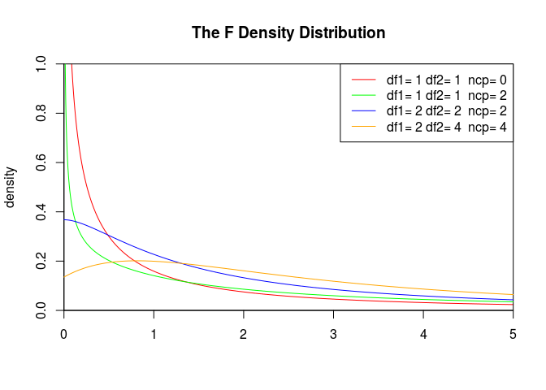

``` r
plot(x,y,col="red",xlim=c(0,5),ylim=c(0,1),type='l',
     xaxs="i", yaxs="i",ylab='density',xlab='',
     main="The F Cumulative Distribution Function")

lines(x,pf(x,1,1,2),col="green")
lines(x,pf(x,2,2,2),col="blue")
lines(x,pf(x,2,4,4),col="orange")

legend("topright",legend=paste("df1=",c(1,1,2,2),"df2=",c(1,1,2,4)," ncp=", c(0,2,2,4)), lwd=1, col=c("red", "green","blue","orange"))
```

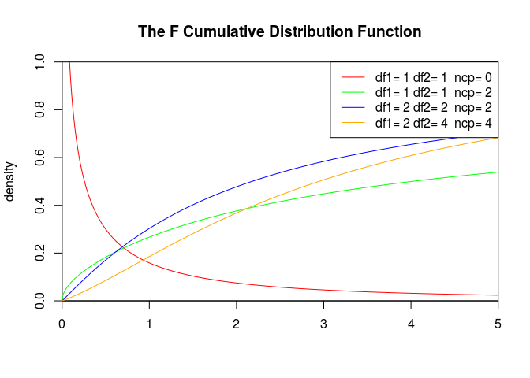

**T分布**

学生t-分布（Student's t-distribution），可简称为t分布。应用在估计呈正态分布的母群体之平均数。它是对两个样本均值差异进行显著性测试的学生t检定的基础。学生t检定改进了Z检定（Z-test），因为Z检定以母体标准差已知为前提。虽然在样本数量大（超过30个）时，可以应用Z检定来求得近似值，但Z检定用在小样本会产生很大的误差，因此必须改用学生t检定以求准确。

在母体标准差未知的情况下，不论样本数量大或小皆可应用学生t检定。在待比较的数据有三组以上时，因为误差无法压低，此时可以用变异数分析（ANOVA）代替学生t检定。

``` r
set.seed(1)
x<-seq(-5,5,length.out=1000)
y<-dt(x,1,0)

plot(x,y,col="red",xlim=c(-5,5),ylim=c(0,0.5),type='l',
     xaxs="i", yaxs="i",ylab='density',xlab='',
     main="The T Density Distribution")

lines(x,dt(x,5,0),col="green")
lines(x,dt(x,5,2),col="blue")
lines(x,dt(x,50,4),col="orange")

legend("topleft",legend=paste("df=",c(1,5,5,50)," ncp=", c(0,0,2,4)), lwd=1, col=c("red", "green","blue","orange"))
```


``` r
plot(x,y,col="red",xlim=c(-5,5),ylim=c(0,0.5),type='l',
     xaxs="i", yaxs="i",ylab='density',xlab='',
     main="The T Cumulative Distribution Function")

lines(x,pt(x,5,0),col="green")
lines(x,pt(x,5,2),col="blue")
lines(x,pt(x,50,4),col="orange")

legend("topleft",legend=paste("df=",c(1,5,5,50)," ncp=", c(0,0,2,4)), lwd=1, col=c("red", "green","blue","orange"))
```

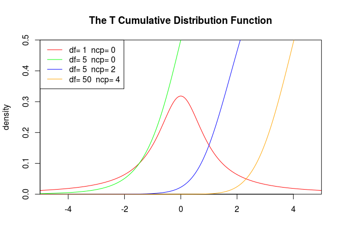

**weibull分布**

weibull(韦伯)分布，又称韦氏分布或威布尔分布，是可靠性分析和寿命检验的理论基础。Weibull分布能被应用于很多形式，分布由形状、尺度（范围）和位置三个参数决定。其中形状参数是最重要的参数，决定分布密度曲线的基本形状，尺度参数起放大或缩小曲线的作用，但不影响分布的形状。

Weibull分布通常用在故障分析领域(field of failure analysis)中；尤其是它可以模拟(mimic) 故障率(failture rate)持续(over time)变化的分布。故障率为：

1.一直为常量(constant over time)， 那么 α = 1， 暗示在随机事件中发生

2.一直减少(decreases over time)，那么α &lt; 1， 暗示"早期失效(infant mortality)"

3。一直增加(increases over time)，那么α &gt; 1， 暗示"耗尽(wear out)"，随着时间的推进，失败的可能性变大

``` r
set.seed(1)
x<- seq(0, 2.5, length.out=1000)
y<- dweibull(x, 0.5)

plot(x, y, type="l", col="blue",xlim=c(0, 2.5),ylim=c(0, 6),
     xaxs="i", yaxs="i",ylab='density',xlab='',
     main="The Weibull Density Distribution")

lines(x, dweibull(x, 1), type="l", col="red")
lines(x, dweibull(x, 1.5), type="l", col="magenta")
lines(x, dweibull(x, 5), type="l", col="green")
lines(x, dweibull(x, 15), type="l", col="purple")
legend("topright", legend=paste("shape =", c(.5, 1, 1.5, 5, 15)), lwd=1,col=c("blue", "red", "magenta", "green","purple"))
```

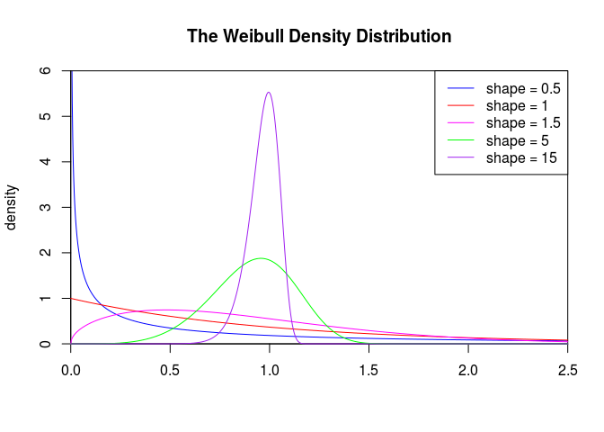

``` r
plot(x, y, type="l", col="blue",xlim=c(0, 2.5),ylim=c(0, 1.2),
     xaxs="i", yaxs="i",ylab='density',xlab='',
     main="The Weibull Cumulative Distribution Function")

lines(x, pweibull(x, 1), type="l", col="red")
lines(x, pweibull(x, 1.5), type="l", col="magenta")
lines(x, pweibull(x, 5), type="l", col="green")
lines(x, pweibull(x, 15), type="l", col="purple")
legend("bottomright", legend=paste("shape =", c(.5, 1, 1.5, 5, 15)), lwd=1, col=c("blue", "red", "magenta", "green","purple"))
```

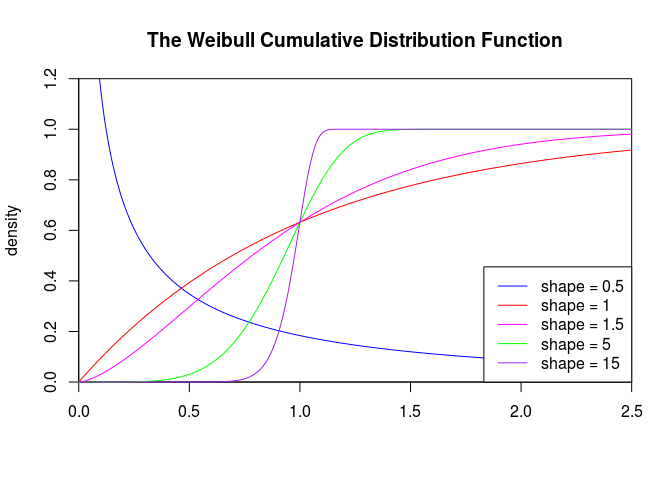

### 通用的分布拟合检验

**Kolmogorov-Smirnov连续分布检验**是检验单一样本是不是服从某一预先假设的特定分布的方法。以样本数据的累计频数分布与特定理论分布比较，若两者间的差距很小，则推论该样本取自某特定分布族。该检验原假设为H0:数据集符合谋指定分布，H1:样本所来自的总体分布不符合某指定分布。令F0(x)表示预先假设的理论分布，Fn(x)表示随机样本的累计概率(频率)函数.

统计量D为: D=max|F0(x) - Fn(x)|，D值越小，越接近0，表示样本数据越接近某指定分布，如果p-value小于显著性水平α(0.05)，则拒绝H0。

``` r
set.seed(1)
S <- rnorm(1000)
ks.test(S, "pnorm") #这里可以指定分布
```

    ## 
    ##  One-sample Kolmogorov-Smirnov test
    ## 
    ## data:  S
    ## D = 0.021051, p-value = 0.7673
    ## alternative hypothesis: two-sided

``` r
cat('结论: D值很小, p-value>0.05，不能拒绝原假设，所以数据集S符合正态分布！')
```

    ## 结论: D值很小, p-value>0.05，不能拒绝原假设，所以数据集S符合正态分布！

``` r
ks.test(S, "punif")
```

    ## 
    ##  One-sample Kolmogorov-Smirnov test
    ## 
    ## data:  S
    ## D = 0.51858, p-value < 2.2e-16
    ## alternative hypothesis: two-sided

``` r
cat('结论: D值很大, p-value<0.05，拒绝原假设，所以数据集S不符合均匀分布！')
```

    ## 结论: D值很大, p-value<0.05，拒绝原假设，所以数据集S不符合均匀分布！

三、随机变量的数字特征
----------------------

**数学期望、方差、标准差**

在概率论和数理统计中，数学期望反映随机变量平均取值的大小，方差和标准差用来度量随机变量和其数学期望（即均值）之间的偏离程度。

``` r
E <- rnorm(10000,mean = 0,sd = 1)
# 数学期望
mean(E)
```

    ## [1] -0.005390948

``` r
# 方差
var(E)
```

    ## [1] 1.006083

``` r
# 标准差
sd(E)
```

    ## [1] 1.003037

**常用统计量(众数,最大,最小,中位数,四分位数)**

``` r
E2 <- c(1,2,3,3,3,7,7,7,7,9,10,21)
# 众数
names(which.max(table(S)))
```

    ## [1] "-3.00804859892048"

``` r
# 最小值
min(E2)
```

    ## [1] 1

``` r
# 最小值的索引
which.min(E2)
```

    ## [1] 1

``` r
# 最大值
max(E2)
```

    ## [1] 21

``` r
# 最大值的索引
which.max(E2)
```

    ## [1] 12

``` r
# 中位数
median(E2)
```

    ## [1] 7

``` r
# 四分位数
quantile(S)
```

    ##          0%         25%         50%         75%        100% 
    ## -3.00804860 -0.69737322 -0.03532423  0.68842795  3.81027668

``` r
fivenum(S)
```

    ## [1] -3.00804860 -0.69742825 -0.03532423  0.68869988  3.81027668

**通用的计算统计函数**

``` r
summary(E2)
```

    ##    Min. 1st Qu.  Median    Mean 3rd Qu.    Max. 
    ##   1.000   3.000   7.000   6.667   7.500  21.000

**协方差**

协方差用于衡量两个变量的总体误差。而方差是协方差的一种特殊情况，即当两个变量是相同的情况。设X,Y为两个随机变量，称E{\[X-E(X)\]\[Y-E(Y)\]}为X和Y的协方差，记录Cov(X,Y)。

``` r
# 计算X(1,2,3,4)和Y(5,6,7,8)的协方差
X <- c(1,2,3,4)
Y <- c(5,6,7,8)
cov(X,Y)
```

    ## [1] 1.666667

**相关系数**

相关系数是用以反映变量之间相关关系密切程度的统计指标。相关系数是按积差方法计算，同样以两变量与各自平均值的离差为基础，通过两个离差相乘来反映两变量之间相关程度。当Var(X)&gt;0, Var(Y)&gt;0时，称Cov(X,Y)/sqrt(Var(X)\*Var(Y))为X与Y的相关系数。

``` r
# 计算X(1,2,3,4)和Y(5,7,8,9)的相关系数
X<-c(1,2,3,4)
Y<-c(5,7,8,9)
cor(X,Y)
```

    ## [1] 0.9827076

**偏度和峰度**

偏度: 是统计数据分布偏斜方向和程度的度量，是统计数据分布非对称程度的数字特征。设分布函数F(x)有中心矩u2=E(X −E(X))^2, u3 = E(X −E(X))<sup>3，则Cs=u3/u2</sup>(3/2)为偏度系数。当Cs&gt;0时，概率分布偏向均值右则,Cs&lt;0时，概率分布偏向均值左则。

峰度: 又称峰态系数。表征概率密度分布曲线在平均值处峰值高低的特征数。峰度刻划不同类型的分布的集中和分散程序。设分布函数F(x)有中心矩u2=E(X −E(X))^2, u4=E(X −E(X))<sup>4，则Ck=u4/(u2</sup>2-3)为峰度系数。

``` r
# 计算10000个正态分布的样本的偏度和峰度
S<-rnorm(10000)
skewness(S)
```

    ## [1] 0.0708999
    ## attr(,"method")
    ## [1] "moment"

``` r
kurtosis(S)
```

    ## [1] -0.001071991
    ## attr(,"method")
    ## [1] "excess"

**协方差矩阵**

协方差矩阵是一个矩阵，其每个元素是各个向量元素之间的协方差。是从标量随机变量到高维度随机向量的自然推广。设X = (X1,X2, ... ,Xn), Y = (Y1, Y2, ..., Ym) 为两个随机变量，则Cov(X,Y)为X,Y的协方差矩阵.

``` r
x <- as.data.frame(matrix(rnorm(10),ncol=2))
cov(x)
```

    ##           V1        V2
    ## V1  3.369616 -0.102042
    ## V2 -0.102042  1.422435

四、大数定律和中心极限定理
--------------------------

使用**animation包**演示大数定律和中心极限定理：

``` r
# install.packages("animation")
library(animation)
```

### 大数定律

大数定律(law of large numbers)，又称大数定理，是判断随机变量的算术平均值是否向常数收敛的定律，是概率论和数理统计学的基本定律之一。

LLN函数：

``` r
lln<-function (FUN, pars=NULL, np = 30, n = ani.options("nmax"),pch = 20,col.poly = "bisque", col.mu = "gray", ...) 
{    dist.name<-deparse(substitute(FUN))
     if(dist.name=='rbinom'){FUN<-function(n,pars) rbinom(n,size=pars[1],prob=pars[2]);mu<-pars[2];}
     if(dist.name=='rpois'){FUN<-function(n,pars) rpois(n,lambda=pars);mu<-pars;}
     if(dist.name=='rnorm'){FUN<-function(n,pars) rnorm(n,mean=pars[1],sd=pars[2]);mu<-pars[1];}
     if(dist.name=='rexp'){FUN<-function(n,pars) rexp(n,rate=pars); mu<-1/pars;}
     if(dist.name=='runif'){FUN<-function(n,pars) runif(n,min=pars[1],max=pars[2]);mu<-sum(pars)/2;}
     if(dist.name=='rchisq'){FUN<-function(n,pars) rchisq(n,df=pars);mu<-pars;}
    
    m = x = NULL
    for (i in 1:n) {
        d = colMeans(matrix(replicate(np, FUN(i*100,pars)), i*100))
        m = c(m, d)
        x = rbind(x, range(d))
    }
    rg = range(m)
    xax = pretty(1:n)
    for (i in 1:n) {
        dev.hold()
        plot(1:n, ylim = rg, type = "n",
             xlab = paste("n =100*", i), 
             ylab = expression(bar(x)), xaxt = "n",main=dist.name)
        axis(1, xax[xax <= i])
        polygon(c(1:i, i:1), c(x[1:i, 1], x[i:1, 2]), 
                border = NA, col = col.poly)
        points(rep(1:i, each = np), m[1:(i * np)], pch = pch, ...)
        abline(h = mu, col = col.mu)
        ani.pause()
    }
}
```

演示几个分布的大数定律：

``` r
# #LLN for Binomial
# lln(FUN=rbinom,pars=c(1,0.5))
# 
# #LLN for Poisson
# lln(FUN=rpois,pars=2)
# 
# #LLN for Uniform
# lln(FUN=runif,pars=c(0,1))
# 
# #LLN for Exponential
# lln(FUN=rexp,pars=2)
```

### 中心极限定理

中心极限定理是判断随机变量序列部分和的分布是否渐近于正态分布的一类定理。在自然界及生产科学实践中，一些现象受到许多相互独立的随机因素的影响，如果每个因素的影响都很小，那么部的影响可以看作是服从正态分布。中心极限定理正是从数学上论证了这一现象。

CLT函数：

``` r
clt <- function (obs = 300, FUN =rexp, mu=0,sds=1,
                 nmax = ani.options("nmax"),
                 col = c("bisque", "red", "blue", "black"),xlim, ...) 
{
    x = matrix(nrow = nmax, ncol = obs)
    for (i in 1:nmax) x[i, ] = apply(matrix(replicate(obs, FUN(i)), i), 2, mean)
    if (missing(xlim)) xlim = quantile(x, c(0.005, 0.995))
    for (i in 1:nmax) {
        dev.hold()
        hist(x[i, ], freq = FALSE, main = "", 
             xlab = substitute(italic(bar(x)[i]), list(i = i)), 
             col = col[1], xlim = xlim)
        lines(density(x[i, ]), col = col[2],lwd=2)
    if(!is.na(mu) && !is.na(sds))
       curve(dnorm(x, mu, sds/sqrt(i)), col = col[3], 
             lty = 2, lwd=2, add = TRUE)
    legend("topright", legend = c("Normal","Est. pdf"),
           lty=2:1, lwd=2, col=c(col[3],col[2]), bty = "n")
    ani.pause()
    }
}

ani.options(interval = 0.5)
par(mar = c(3, 3, 1, 0.5), mgp = c(1.5, 0.5, 0), tcl = -0.3)
```

演示几个分布的中心极限定理：

``` r
# #Poisson case
#   f<-function(n) rpois(n,lambda=4);
#   clt(FUN = f, mu=4,sds=2)
# 
# #binomial case
#   f<-function(n) rbinom(n,size=1,prob=0.5)
#   clt(FUN = f, mu=0.5, sds=0.5)
# 
# #exponential distribution case
#   f<-function(n) rexp(n,rate=2);
#   clt(FUN = f, mu=1/2,sds=1/2)
# 
# #uniform distribution case
#    f<-function(n,pars) runif(n,min=0,max=1);
#    clt(FUN = f,mu=1/2,sd=1/sqrt(12))
# 
# #chi-square distribution
#   f<-function(n) rchisq(n,df=2);
#   clt(FUN = f,mu=2,sd=2)
```
